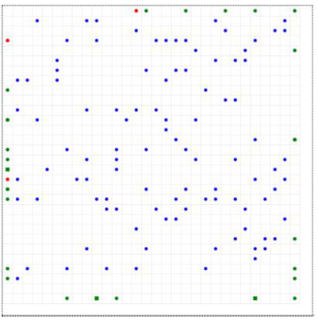

# FEUP-ASMA (Agentes e Sistemas Multi-Agente)

## Project 1

For the first project, we built a multi-agent system that manages air traffic control. We simulated this problem with considering the following:

- Each airplane has its own remaining fuel, a minimum time and space required to land, 
- The airport has different priorities based on the company of the airplane, potential emergencies and the number of passengers. 
- The number of runways are scarce and the aim is to make the best use of them. 
- The allocation of airplanes to runways should be dynamic and done through negotiation between agents.

### Dependant Variables

- Waiting Times
- Airstrip Allocation / Occupation
- Fuel Used

### Independent Variables:
- Starting Fuel
- Minimum time to land each aircraft
- Minimum space to land each aircraft
- Number of Airstrips

## Project 2

The second project consisted of simulating the process of natural selection with an agent-based model using the Mesa for Python.

Animals compete in a shared, grid-like environment that contains randomly placed food that is eaten by those animals. Animals use energy to travel, walking randomly through the grid and eating the food they find on their path. Based on the amount of food found, they may survive, die or reproduce.  Upon reproduction, the animals mutate and propagate their traits like speed and size. The simulation enables the observation of the population and the dominance of each trait. 

#### Label

Food: blue
Green: slow animals
Red: Fast animals
Circles: **don't** have perception
Squares: have perception
Size: size of circle/square

